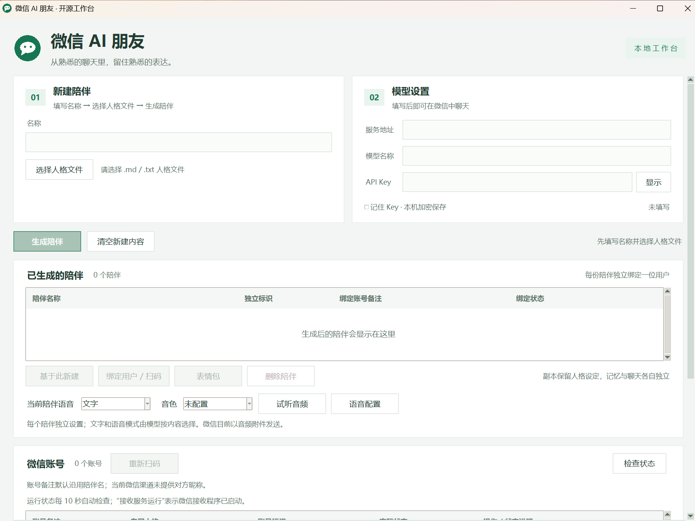

# 微信 AI 朋友

这是一个运行在 Windows 上的微信 AI 陪伴工作台。你可以导入人格文件，创建具有不同性格和说话方式的 AI 陪伴，再通过扫码绑定微信进行聊天。

项目支持多用户使用，每位用户拥有独立的人格、记忆和聊天记录。机器人可以回复文字、表情包和语音，其中语音以音频文件附件的形式发送。你可以为不同陪伴单独配置表情包和音色，并在工作台中管理账号、查看运行状态和聊天记录。

## 使用

需要 64 位 Windows。启动前自动检查 Python、Pillow、Node.js、OpenClaw 和微信插件，仅补齐缺失或不兼容的组件，已装好的直接复用。

1. 双击 `启动微信机器人.bat`；也可以先运行 `安装依赖.bat` 提前准备环境；对话时要启动OpenClaw.bat。
2. 输入陪伴名称，选择 `examples/persona.md` 或自己的 `.md` / `.txt` 人格文件，生成陪伴。
3. 填写模型服务地址、模型名称和 API Key。
4. 选中陪伴，点击绑定用户 / 扫码，用微信扫码授权。

文本模型请自行填写服务地址、模型名和 Key。需要语音时，请到 [Fish Audio 官网](https://fish.audio/)获取自己的 API Key，并选择音色、取得音色 ID；在工作台点击“语音配置”填写两项，再开启“文字和语音”。本工具不下载或安装模型，未配置时会提示。聊天时需保持 OpenClaw 运行。

内置虚构人格“小伴”和六张原创小猫表情。开源包不提供音频文件、内置音色或 API Key；语音回复和试听使用用户自行配置的在线音色。[模拟对话](examples/demo_chat.md) · [素材来源与许可](docs/ASSET_LICENSES.md)

本仓库不包含个人账号、API Key 或聊天记录。使用在线模型时，聊天内容会发送给你配置的文本模型服务；生成语音时，回复文字会发送给 Fish Audio。

[详细使用说明](docs/USAGE.md) · [验证结果](docs/VERIFICATION.md) · [MIT 许可证](LICENSE) · [第三方说明](THIRD_PARTY_NOTICES.md)
